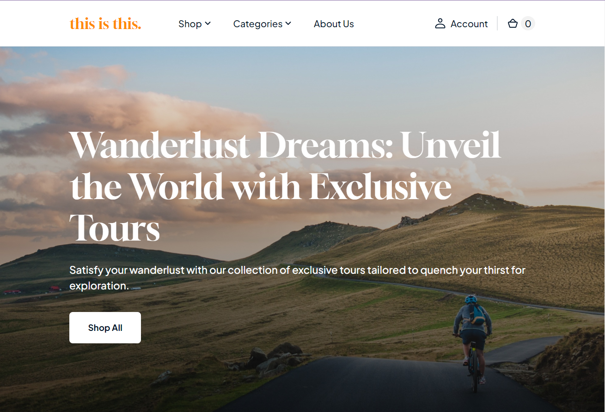

<h1  align="center">Hello, i'm Yauheni Baltsevich 👋</h1>
<h3  align="center"><i>Full Stack Developer (React, Node.js)</i></h3>

	<h3>Connect with me on</h3>
	

		<a  href="https://www.linkedin.com/in/eugenebalts/">
			</img>
		</a>
		<a  href="mailto:norcobeatz@gmail.com">
			</img>
		</a>
		<a  href="https://t.me/eugenebalts">
			</img>
		</a>
	

## About me

🗽 I Live in Poland, Warsaw  
💻 In Web Development journey since December 2022  (with ~one year of commercial exp as React Developer)
👨🏿‍🎓 Finished **_The Rolling Scopes School_** courses  
💼 Open to work

---

	<h2 align="center">P R O J E C T S</h2>
	<table align="center">
		<tr>
			<td align="center" colspan="2"><h3>F R O N T E N D</h3></td>
		</tr>
		<tr>
			<td align="center">
				
			</td>
			<td align="left">
				<h2>this is this.</h2>
				

				
<b>Description</b>: <b><i>this is this.</i></b><i> is a web application for searching and buying travel tours.
					The project is being developed as part of the final task of the course <a href="https://rs.school/js/" target="_blank">
					JavaScript/Front-end (2023Q1)</a> by the <a href="https://rs.school/" target="_blank">RS School</a>
				</i>

				

				
<b>Technology stack</b>: <i>TypeScript, Webpack 5, Jest, SCSS, CommerceTools API , Prettier, ESLint, Husky, lint-staged.</i>

				

				
<a href="https://github.com/eugenebalts/e-commerce" target="_blank"><i>Repository</i></a>

				
<a href="https://this-is-this.onrender.com/" target="_blank"><i>Demo</i></a>

			</td>
		</tr>
		<tr>
			<td align="center">
				
			</td>
			<td align="left">
				<h2>Async Race</h2>
				

				
<b>Description</b>: <b><i>Async Race</i></b><i> is a web application for managing radio-controlled cars, drag-racing competition and showcasing race statistics. </i>

				

				
<b>Technology stack</b>: <i>React, Redux, TypeScirpt, SASS, ESLinter, Prettier, Framer Motion</i>

				

				
<a href="https://github.com/eugenebalts/test-async-race" target="_blank"><i>Repository</i></a>

				
<a href="https://test-async-race.onrender.com/" target="_blank"><i>Demo</i></a>

			</td>
		</tr>
		<tr>
			<td align="center" colspan="2"><h3>B A C K E N D</h3></td>
		</tr>
		<tr>
			<td align="center" colspan="2">
				<h2>Home Library Service</h2>
				

				
<b>Description</b>: <b><i>Home Library Service</i></b><i> 
						is a backend service designed to manage users' personal music library. 
						The service provides an API for creating, editing and viewing albums, artists, tracks, and adding 
						them to favorites. The system includes user management and authentication functionality.
				</i>

				

				
<b>Technology stack</b>: <i>NestJS, TypeScript, PostgreSQL, TypeORM, JWT, Bcrypt, Swagger, Docker, Jest, Prettier, ESLint.</i>

				

				
<a href="https://github.com/eugenebalts/nodejs2024Q1-service" target="_blank"><i>Repository</i></a>

			</td>
		</tr>
	</table>

---

	<h1><b> Skills<b> </h>
		

	

		
		
		
		
		
		
		
		
	

