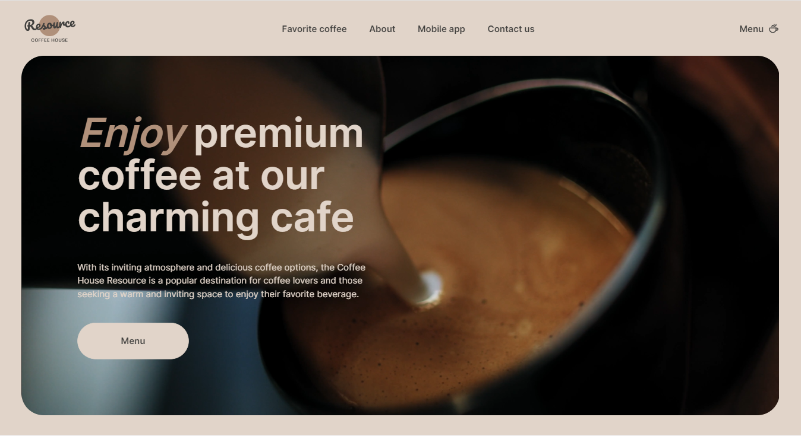

<h1  align="center">Hello, i'm Yauheni Baltsevich 👋</h1>

	<h3>Connect with me on</h3>
	

		<a  href="https://www.linkedin.com/in/eugenebalts/">
			</img>
		</a>
		<a  href="mailto:norcobeatz@gmail.com">
			</img>
		</a>
		<a  href="https://t.me/eugenebalts">
			</img>
		</a>
	

## About me

🗽 I Live in Poland, Warsaw  
💻 In Front-end Development journey since December 2022  
👨🏿‍🎓 Finished **_The Rolling Scopes School_** courses  
❄️ I'm currently deepening my knowledge in React

---

	<h2 align="center">P R O J E C T S</h2>
	<table align="center">
		<tr>
			<td width="100%"><h2> Frontend </h2></td>
		</tr>
		<tr>
			<td align="center">
				
			</td>
			<td align="left">
				<h2>this is this.</h2>
				

				
<b>Description</b>: <b><i>this is this.</i></b><i> is a web application for searching and buying travel tours.
					The project is being developed as part of the final task of the course <a href="https://rs.school/js/" target="_blank">
					JavaScript/Front-end (2023Q1)</a> by the <a href="https://rs.school/" target="_blank">RS School</a>
				</i>

				

				
<b>Technology stack</b>: <i>TypeScript, Webpack 5, Jest, SCSS, CommerceTools API , Prettier, ESLint, Husky, lint-staged.</i>

				

				
<a href="https://github.com/eugenebalts/e-commerce" target="_blank"><i>Repository</i></a>

				
<a href="https://this-is-this.onrender.com/" target="_blank"><i>Demo</i></a>

			</td>
		</tr>
		<tr>
			<td align="center">
				
			</td>
			<td align="left">
				<h2>Coffee-house</h2>
				

				
<b>Description</b>: <b><i>Coffee-house</i></b><i> is a web development project aimed at creating a responsive and interactive website with two main pages: 'Home' and 'Menu.' The project is divided into three weeks, each focusing on specific tasks. </i>

				

				
<b>Technology stack</b>: <i>TypeScript, Webpack 5, SCSS</i>

				

				
<a href="https://github.com/eugenebalts/coffee-house" target="_blank"><i>Repository</i></a>

				
<a href="https://eugenebalts.github.io/coffee-house/coffee-house/dist/" target="_blank"><i>Demo</i></a>

			</td>
		</tr>
		<tr>
			<td align="center">
				
			</td>
			<td align="left">
				<h2>Shelter</h2>
				

				
<b>Description</b>: <b><i>Shelter</i></b><i> is a platform dedicated to a pet shelter named "Cozy House" in Boston. It serves the purpose of showcasing the shelter's mission, introducing available pets, and fostering user engagement. </i>

				

				
<b>Technology stack</b>: <i>JavaScript, HTML, CSS</i>

				

				
<a href="https://github.com/eugenebalts/shelter" target="_blank"><i>Repository</i></a>

				
<a href="https://eugenebalts.github.io/shelter/shelter/" target="_blank"><i>Demo</i></a>

			</td>
		</tr>
		<tr>
			<td align="center">
				
			</td>
			<td align="left">
				<h2>Minesweeper</h2>
				

				
<b>Description</b>: <b><i>Minesweeper</i></b><i> is a logic puzzle video game. The goal is to clear the board without detonating any mines, using clues about the number of adjacent mines on each board. </i>

				

				
<b>Technology stack</b>: <i>JavaScript, HTML, CSS, Webpack 5</i>

				

				
<a href="https://github.com/eugenebalts/minesweeper" target="_blank"><i>Repository</i></a>

				
<a href="https://eugenebalts.github.io/minesweeper/minesweeper/dist/" target="_blank"><i>Demo</i></a>

			</td>
		</tr>
	</table>

---

	<h1><b> Skills<b> </h>
		

	

		
		
		
		
		
		
		
		
	

